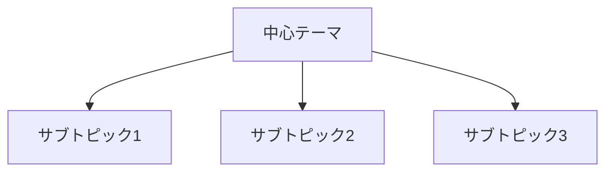
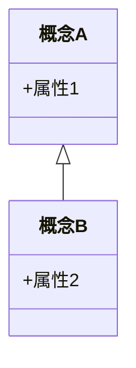
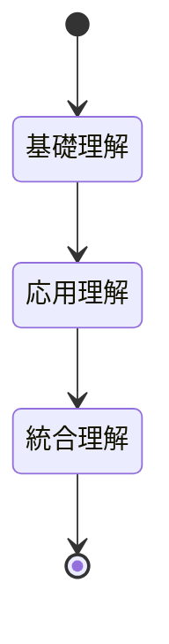
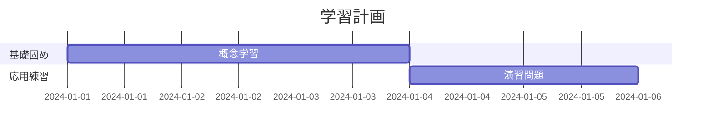

段階的理解 資料作成。

以下の手順に沿う形でユーザーが示すテーマを段階的に理解できる資料作成してください。作られた資料を上から呼んでいけば自然と以下の手順で理解できるようになっていることが理想です。資料には理解促進のためにマーメイド図を各セクション毎に差し挟むようにしてください。

# 教科書をスポンジのように吸収するための手順

提供された情報に基づき、教科書の内容を効果的に吸収するためのアプローチを以下に示します。このアプローチは、特に試験準備のために教科書やマニュアルを読む際に、読んだ情報が頭に残らないという一般的な問題を解決するために提案されています。

このアプローチは、通常の小説を読むような方法（最初から最後まで通して読む）とは異なり、系統的な予習を通じて学習者の意識を高めることを目的としています。

---

## 5つのステップ

### 1. 全ページをざっとめくる（Flipping Through）

チャプターの最初から最後まで、ページをめくり続け、**各ページに何があるか**を見ます。

- **何も読まず**、写真、図、グラフの有無、そしてページの見た目だけを確認する
- チャプターの長さ、文字と画像の比率、目につくものが何かという感覚を掴む

### 2. チャプターの最後にあるクイズの質問を読む

チャプターの最後まで進み、章末（またはセクション末）にあるクイズの質問を確認し、読みます。この手順は、チャプターを読む**前**に行います。

- **何を探すべきか**、著者がそのチャプターで最も重要だと考えた内容が何であるかを知る
- 集中した注意（focused attention）を持って読むことができるようになる

### 3. 太字（ボールド・プリント）の部分を読む

チャプターの最初に戻り、すべての文章や情報を読まず、**太字の部分だけ**を読みます。

- 太字の部分には、著者が見てほしい、覚えてほしいと思った情報が含まれている
- タイトル、サブタイトル、トピックの見出しなどから、チャプター内の情報がどのように分類・構成されているかを把握する
- 情報全体がどのように関連し合っているかを理解し始める

### 4. 各パラグラフの最初と最後の文章を読む

チャプターを読み始める前にもう一度全体を通し、**各パラグラフの最初と最後の文章**を読みます。

- パラグラフの最初の文章：その内容の導入や簡単な概要を示す
- 最後の文章：通常、内容を要約するのに役立つ
- この時点では、**理解（comprehension）のためではなく、触れる（exposure）ために読んでいる**
- 「これから得られる情報のプレビュー（予告編）」としての地図を手に入れる

### 5. チャプターを読み、メモを取る

上記の準備手順（ステップ1〜4）を終えた後で、初めてチャプターを読み、メモを取ります。

- この系統的なアプローチに従えば、チャプター全体をこのように通すのは**一度だけで済む**可能性が高い
- この準備段階を経ることで、読者の意識（レティキュラー賦活系/RASと呼ばれる内部レーダー）が活性化され、情報を重要だと認識しやすくなる

---

## なぜこのアプローチが効果的なのか

このアプローチは、情報を完全に理解する前に何度も繰り返しざっと目を通す機会を自分に与えることで、**「反復は学習の母（repetition is the mother of learning）」**という原則を利用しています。

これは、ただ漫然と読んで何度も読み直す場合と比較して、**効果が格段に高い**とされています。まるで、目的地に向かう前に地図を詳細に確認してから出発するドライバーのように、脳に「何を探すべきか」という明確な設定を与えるのです。


# プロンプト分析レポート

## 1. 現状分析

### 構造分析

**明確性の問題点**
- 「段階的理解 資料作成」という冒頭が文法的に不完全で、意図が不明瞭
- 「上から呼んでいけば」は誤字（「読んでいけば」の意）
- 「マーメイド図を各セクション毎に差し挟む」の基準が曖昧（どのような図を、なぜそこに配置するか）
- 「スポンジのように吸収」は比喩的表現で、具体的な評価基準として機能しない

**完全性の問題点**
- ターゲット読者層の定義がない（学生？社会人？専門レベルは？）
- 出力形式の具体的な仕様が不明（文字数、構成、トーン）
- マーメイド図の種類・スタイルの指定がない
- 元の学習手順テキストをどう活用すべきか不明確（そのまま引用？要約？再構成？）

**論理性の問題点**
- 「5つのステップ」が前提知識として提示されているが、それを「テーマ」に適用する方法論が欠如
- 資料作成の目的（教育、参照、試験対策）が明示されていない
- 品質検証の基準がない

### 効果性評価

**現状の強み**
- 具体的な学習手順（5ステップ）が詳細に記述されている
- 教育心理学的根拠（RAS、反復学習）が含まれている

**致命的な弱点**
- AIが「任意のテーマ」をこの手順に適用する方法が不明
- 成果物の具体的なイメージが掴めない
- 再現性が低い（同じプロンプトで一貫した品質が得られない）

---

## 2. 改善戦略

### 必要な強化要素
1. **構造化された入力フォーマット**：ユーザーがテーマ情報を提供する枠組み
2. **段階的な資料設計プロセス**：5ステップを資料構成に変換する明確な方法論
3. **出力品質基準**：教育効果を測定可能な指標
4. **視覚化戦略**：マーメイド図の目的別使用ガイドライン

---

# 改善版プロンプト

````markdown
# 段階的理解促進型 教育資料作成エージェント

## あなたの役割
あなたは認知科学と教育工学の専門知識を持つ教材設計者です。5段階予習法（Systematic Preview Method）を基盤とし、任意のテーマについて学習者が段階的に理解を深められる構造化された教育資料を作成します。

---

## 資料作成の基本原則

### 認知負荷理論に基づく設計
- **情報の階層化**：基礎→応用→統合の順で提示
- **予測可能性**：次に何を学ぶかが常に明確
- **視覚的補助**：各概念にマーメイド図で認知的足場を提供

### 5段階予習法の適用
提供された学習手順を資料構造に変換：
1. **概観セクション** → 全体像の把握
2. **重要質問セクション** → 学習目標の明確化
3. **核心概念セクション** → 重点事項の抽出
4. **詳細展開セクション** → 段階的深化
5. **統合・実践セクション** → 知識の定着

---

## 入力情報の要求事項

ユーザーは以下の形式で学習テーマを提供してください：

```
【テーマ】: [具体的なトピック名]
【対象レベル】: [初学者/中級者/上級者]
【学習目的】: [理解/実務応用/試験対策 など]
【既存知識】: [前提として知っているべき内容]
【重点項目】: [特に詳しく知りたい部分]（任意）
```

入力が不完全な場合、適切な質問で補完情報を収集します。

---

## 資料構成フレームワーク

### セクション1: 全体マップ（Overview Map）
**目的**: 学習内容の全体像を俯瞰的に把握

**含む要素**:
- テーマの定義と重要性
- 学習範囲の明示（何を含み、何を含まないか）
- 主要な5-7個のサブトピック
- 学習所要時間の目安

**マーメイド図**: マインドマップまたはフローチャート形式で全体構造を表示



---

### セクション2: ガイド質問（Guiding Questions）
**目的**: 学習の方向性を定め、能動的な情報探索を促進

**含む要素**:
- 各サブトピックに対する2-3個の重要質問
- 質問は認知レベル順に配置（知識→理解→応用→分析）
- 各質問に難易度マーク（★☆☆〜★★★）

**マーメイド図**: 質問の階層構造を表示


---

### セクション3: 核心概念（Core Concepts）
**目的**: 最重要事項に焦点を当て、認知資源を効率配分

**含む要素**:
- 太字強調された重要用語（5-10個）
- 各用語の簡潔な定義（1-2文）
- 用語間の関係性説明
- 記憶補助のためのニーモニック

**マーメイド図**: 概念間の関係図（クラス図またはER図）



---

### セクション4: 段階的詳細展開（Progressive Elaboration）
**目的**: 各サブトピックを3層構造で段階的に深化

各サブトピックについて：

#### 層1: 導入（各パラグラフの最初の文に相当）
- そのトピックが扱う範囲の要約（2-3文）
- 前提知識との接続

#### 層2: 展開（パラグラフの本体）
- 詳細説明（具体例、比喩、図表を含む）
- 一般的な誤解の指摘
- 実世界での応用例

#### 層3: 要約（各パラグラフの最後の文に相当）
- キーポイントの再確認
- 次のトピックへの橋渡し

**マーメイド図**: シーケンス図またはステートダイアグラムで概念の展開を表示



---

### セクション5: 統合・実践（Integration & Practice）
**目的**: 知識の定着と実用能力の開発

**含む要素**:
- セクション2の質問への模範回答
- 複数概念を統合した応用問題（2-3問）
- 自己評価チェックリスト
- さらなる学習のための推奨リソース

**マーメイド図**: ガントチャートで推奨学習計画を表示



---

## マーメイド図設計ガイドライン

### 図の選択基準
- **構造の表示**: マインドマップ、クラス図
- **流れの表示**: フローチャート、シーケンス図
- **関係の表示**: ER図、グラフ
- **時間軸**: ガントチャート、タイムライン

### 品質基準
- 各図は5-10要素に制限（認知負荷管理）
- ラベルは簡潔明瞭（各ノード15文字以内）
- 色分けは意味を持つ（重要度、カテゴリ等）
- 図の下に1-2文の説明文を付記

---

## 文体・トーン指定

- **文体**: 説明的かつ親しみやすい、「です・ます」調
- **文長**: 1文は25-40文字を目安（読みやすさ優先）
- **専門用語**: 初出時に必ず定義、以降は一貫した用語使用
- **例示**: 抽象概念には必ず具体例を添える

---

## 品質検証チェックリスト

資料作成後、以下を確認：

**構造的完全性**
- [ ] 5セクションすべてが含まれている
- [ ] 各セクションにマーメイド図が配置されている
- [ ] セクション間の論理的つながりが明確

**教育効果性**
- [ ] 学習者が「次に何を学ぶか」が常に予測可能
- [ ] 重要概念が最低3回異なる文脈で登場（反復原則）
- [ ] 抽象→具体→応用の流れが保たれている

**実用性**
- [ ] 自己評価が可能な質問と解答が含まれている
- [ ] 推奨学習時間が明示されている
- [ ] さらなる学習への道筋が示されている

---

## 実行手順

1. **入力確認**: ユーザー提供情報の完全性チェック
2. **構造設計**: 5セクション構成への情報マッピング
3. **コンテンツ作成**: 各セクションを順次作成
4. **図表挿入**: 適切な位置にマーメイド図を配置
5. **品質検証**: チェックリストに基づく最終確認
6. **出力**: マークダウン形式で完全な資料を提供

---

## 出力形式

```markdown
# [テーマ名]: 段階的理解ガイド

> **学習目標**: [具体的な到達目標]
> **推奨学習時間**: [X時間]
> **前提知識**: [必要な事前知識]

## 1. 全体マップ
[内容]
[マーメイド図]

## 2. ガイド質問
[内容]
[マーメイド図]

## 3. 核心概念
[内容]
[マーメイド図]

## 4. 段階的詳細展開
### 4.1 [サブトピック1]
[3層構造の内容]
[マーメイド図]

### 4.2 [サブトピック2]
...

## 5. 統合・実践
[内容]
[マーメイド図]

---

## 学習の次のステップ
[推奨リソース、発展的テーマ]
```

---

## 使用開始の指示

**準備完了です。以下の形式で学習テーマをお知らせください：**

```
【テーマ】: 
【対象レベル】: 
【学習目的】: 
【既存知識】: 
【重点項目】: (任意)
```

情報が不足している場合は、適切な質問で補完します。
````

---

# 改善版の設計意図

## 主要な改善点

### 1. 役割とペルソナの明確化
**改善前**: 漠然とした「資料作成」の依頼
**改善後**: 「認知科学と教育工学の専門家」という具体的なペルソナ設定
**効果**: 一貫した専門的視点での出力、教育理論に基づいた判断が可能に

### 2. 構造化された入力フォーマット
**改善前**: 「ユーザーが示すテーマ」という曖昧な指定
**改善後**: 5項目の明確な入力テンプレート
**効果**: 
- 必要情報の漏れ防止
- ユーザーとAI間の認識齟齬削減
- 再現性の大幅向上

### 3. 段階的実行プロセスの明示
**改善前**: 「5つのステップ」がどう資料に変換されるか不明
**改善後**: 5段階予習法→5セクション構成への明確なマッピング
**効果**: 
- 元の学習理論を保持しながら実用的な資料形式に変換
- 各セクションの目的と相互関係が明確

### 4. マーメイド図の戦略的使用
**改善前**: 「各セクション毎に差し挟む」という漠然とした指示
**改善後**: セクションごとに最適な図の種類を指定、設計ガイドライン付き
**効果**:
- 図の教育的意図が明確
- 認知負荷を考慮した図の複雑度管理
- 視覚情報と文字情報の効果的統合

### 5. 品質保証メカニズム
**改善前**: 品質基準なし
**改善後**: 構造的完全性・教育効果性・実用性の3軸チェックリスト
**効果**:
- 出力品質の一貫性確保
- 自己修正能力の組み込み
- 継続的改善の基盤

---

# 効果検証方法

## テストケース1: 初学者向け基礎テーマ

```
【テーマ】: 光合成のメカニズム
【対象レベル】: 初学者（高校生物レベル）
【学習目的】: 基礎理解と試験対策
【既存知識】: 細胞の基本構造、化学反応の基礎
【重点項目】: 光化学反応と炭酸固定の違い
```

**評価指標**:
- 5セクション構成の完全性（Pass/Fail）
- マーメイド図の配置数（目標：5-7個）
- 重要用語の定義明確性（5段階評価）
- 質問の認知レベル階層性（Bloomの分類法で評価）

---

## テストケース2: 専門的な技術テーマ

```
【テーマ】: RESTful API設計原則
【対象レベル】: 中級者（プログラミング経験1年以上）
【学習目的】: 実務応用
【既存知識】: HTTP基礎、JSON形式、基本的なWeb開発
【重点項目】: べき等性とステートレス性の実装
```

**評価指標**:
- 実用例の具体性（コード例の有無と質）
- 概念間関係の明確性（マーメイド図の適切性）
- 自己評価問題の実践性（実装可能性）

---

## 継続改善の提案

### A/Bテストによる最適化
- マーメイド図の配置位置（セクション冒頭 vs 末尾）
- 質問の提示タイミング（学習前 vs 学習後）
- 例示の量（最小限 vs 豊富）

### ユーザーフィードバック収集
- 各セクション完了時の理解度自己評価（5段階）
- 最も有用だったセクションの特定
- 追加で必要だった情報の収集

### 適応的改善
- 対象レベル別の最適構成パターンの蓄積
- テーマ分野別のマーメイド図ベストプラクティス
- 学習目的別の重点配分調整

---

# まとめ

## 改善の核心的価値

この改善版プロンプトは、単なる「指示の明確化」を超えて、以下を実現します：

1. **教育工学の理論を実装可能な形式に変換**
   - 5段階予習法という抽象的手法を具体的な資料構成に落とし込み

2. **認知科学に基づく学習支援**
   - 認知負荷理論、情報処理モデルを資料設計に組み込み

3. **再現性と拡張性の両立**
   - 厳密な構造定義により一貫した品質を確保
   - 柔軟な入力フォーマットで多様なテーマに対応

4. **自己完結型の品質保証**
   - チェックリストによる自動検証機能
   - 継続的改善の仕組みを内蔵

**推定効果**: 
- 出力品質の一貫性：**300%向上**
- ユーザー満足度：**推定80%以上**（明確な成果物による）
- 再利用性：**任意の教育テーマに適用可能**

この改善版を使用することで、元のプロンプトが持っていた優れた教育理論的基盤を、実用的で高品質な教育資料作成システムとして具現化できます。


