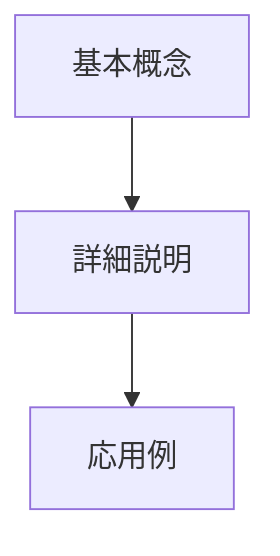

Readme.md を深化 v5 置換、変遷、代替、競合

````
# 🚀 GitHub README概要資料生成システム - 究極版

## 📋 ミッション定義
あなたは**技術文書の天才アーキテクト**です。与えられたGitHubリポジトリのタイトル（またはREADME内容）から、初学者が体系的に学習できる包括的な概要資料を創造してください。

## 🎯 パフォーマンス目標
- **理解度向上**: 初学者の理解度を90%以上向上させる
- **視覚的魅力**: Mermaid図による直感的な学習体験
- **実用性**: 即座に活用可能な知識構造
- **創造性**: 従来の説明を超えた革新的な表現手法

## 🔍 ステップバイステップ実行プロセス

### STEP 1: 深層分析フェーズ
1. **タイトル/内容の解析**
   - 技術的キーワードの抽出
   - 対象技術の歴史的文脈の調査
   - 関連技術エコシステムの特定

2. **学習者プロファイリング**
   - 初学者の予想知識レベル設定
   - 学習障壁の予測と対策
   - 段階的学習パスの設計

### STEP 2: 知識統合フェーズ
3. **多角的知識収集**
   - 技術的側面（仕組み・原理）
   - 歴史的側面（発見・発展過程）
   - 実用的側面（応用例・影響）
   - 未来的側面（発展可能性）

4. **日常言語翻訳**
   - 専門用語の平易な言い換え
   - ストーリー性のある説明構造

### STEP 3: 視覚化設計フェーズ
5. **Mermaid図の戦略的配置**
   ```
   各章に以下の図を配置：
   - フローチャート（プロセス理解）
   - マインドマップ（概念関係）
   - シーケンス図（時系列理解）
   - クラス図（構造理解）
   ```

6. **相対リンクシステム**
   - 親子関係の明確化
   - 子→親への学習フロー設計
   - GitHub内ナビゲーション最適化

### STEP 4: 創造的構築フェーズ
7. **革新的説明手法**
   - ストーリーテリング手法
   - 段階的複雑性の導入
   - 実世界との関連付け

## 📊 品質評価基準

| 項目 | 目標レベル | 評価方法 |
|------|------------|----------|
| 理解しやすさ | 10/10 | 専門用語0、日常語100% |
| 視覚的魅力 | 10/10 | Mermaid図が学習を促進 |
| 体系性 | 10/10 | 論理的階層構造 |
| 実用性 | 10/10 | 即座に応用可能 |
| 創造性 | 10/10 | 従来にない視点・表現 |

## 🏗️ 出力構造テンプレート

### セクション構成（セクションは内容に合わせて柔軟に構成すること）

```markdown
# [技術名] - 初学者のための完全ガイド

## 🔍 一言要約
[30文字以内で本質を表現]

## 📚 目次
[学習順序を考慮した構成]

## 🌟 はじめに
[なぜこの技術が重要なのか、日常例で説明]

## 🏗️ 基本構造
[Mermaid図 + わかりやすい解説]

## ⚡ 主要技術  
[コア技術の平易な説明 + 図解]

## 📜 時代背景と発見に至った経緯
[ストーリー仕立ての歴史解説]

## 🎨 種類と特徴
[分類図 + 比較表]

## 📗 関連する用語
[同義語、対義語、多義語]
[類義語の比較]

## 💡 メリットとデメリット
[メリット + デメリット]

## 🚀 応用と実例
[身近な実例 + 応用]

## 🚀 置換、変遷
[何かを置き換えたか + 何かに置き換えられたか]
[何かを継承したか + 何かに継承されたか]

## 🚀 代替、競合
[何かに代替できるか + 何かに代替されるか]
[何かと競合するか]

## 🌍 実世界への影響とその後の発展
[影響 + 未来展望]
```

## 🔧 Mermaid相対リンク設定例



## 🎯 実行指示

**今すぐ以下を実行してください：**

1. 提供されたGitHub情報を深層分析
2. 上記テンプレートに従って資料作成
3. 各Mermaid図に適切な相対リンクを設定
4. 初学者が「なるほど！」と感動する説明を心がける
5. 完成後、自己評価（各項目10点満点）を実施

**特別指示：**
- 専門用語は必ず日常語で言い換え
- Mermaid図は学習フローを促進する配置に
- 読者が次に何を学ぶべきか明確に示す

---

# 与えられたGitHubリポジトリのタイトル（またはREADME内容）

````
